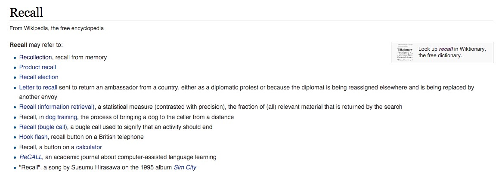
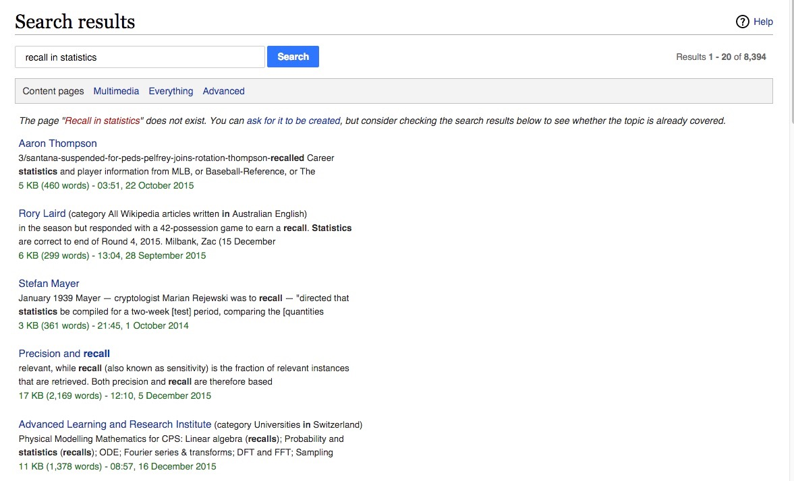

#### Eric Bai
#### 12/20/2015

# Searching by Category: a search engine with user input category for wikipedia

## Motivation

There are often times when people search a key word in wikipedia, the return page is a list of
possible meanings/links for user to choose from. However, if a user use combination of both the key word and the category, wikipedia are not able to return the related results immediately. Instead, it will still return a page of lists of possible links. For example, search results for [recall](https://en.wikipedia.org/wiki/Recall) and [recall in statistcs](https://en.wikipedia.org/w/index.php?search=recall+in+statistics&title=Special%3ASearch&go=Go) in wikipedia is as following.The goal is to load [recall in statistics](https://en.wikipedia.org/wiki/Precision_and_recall) directly.

## Data Pipeline and Modeling

### Step 1:

* Start with small wikipedia data on S3 (s3n://wikisample10/sample2)
* Use TF-IDF and Kmeans for topic modeling to group articles into categories (and maybe subcategories)
* Page rank all pages with directed graphs using NetworkX
* Based on the closet category search for the highest page rank for the user
* Run the model on the whole dataset
* Build a usable web app

### Step 2:

* More complicated models (including more factors such as geo location in search engine, and/or more complicated model for topic modeling such as Latent Dirichlet allocation) can be applied if there is more time left.

### Step 3:

* Write a script to train the data monthly whenever the new wikipedia dataset is released.

#### Everything in step 1 should be finished with in the first week of Jan, then I can make more complicated models if time permitted.

#### Potential probalems:

* For a given user input category, two or more categories may have similar probabilities, in this case I think it is better to show the lists with highest probabilities rather than showing one page.

### Data

The data for step 1 is already stored in S3 given in the repo.
And here are [sample data](https://github.com/xiaoyubai/project-proposals/blob/master/data/sampledata)

### References

* Blei, David M., Andrew Y. Ng, and Michael I. Jordan. "Latent dirichlet allocation." the Journal of machine Learning research 3 (2003): 993-1022.

* Page, Lawrence, et al. "The PageRank citation ranking: bringing order to the Web." (1999).
